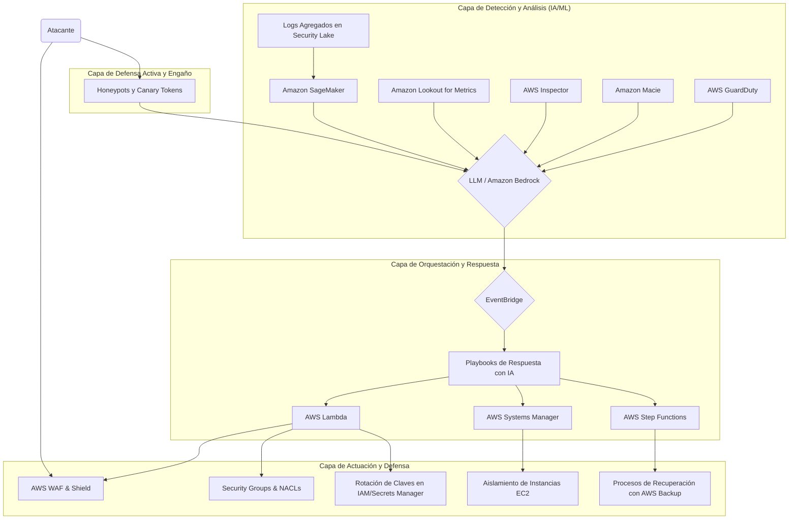

# Documento 1: Arquitectura de Seguridad Adaptativa en AWS

## 1. Introducción a la Arquitectura

La arquitectura de seguridad propuesta está diseñada como un sistema de defensa en profundidad, multicapa y adaptativo, que aprovecha la inteligencia artificial y el machine learning para pasar de un modelo de seguridad reactivo a uno proactivo y predictivo. El núcleo de esta arquitectura es un **Modelo de Lenguaje Grande (LLM)** que actúa como el cerebro del Centro de Operaciones de Seguridad (SOC), orquestando servicios de AWS para identificar, proteger, detectar, responder y recuperarse de amenazas en tiempo real.

La solución se fundamenta en los principios de **Zero Trust**, donde nada se confía por defecto, y la automatización extensiva para minimizar los tiempos de respuesta y reducir el error humano. La siguiente arquitectura conceptual ilustra el flujo de información y las interacciones entre los componentes clave.

*(Nota: A continuación se describe un diagrama conceptual. La generación visual del mismo se puede realizar con herramientas como Mermaid o D2 a partir de esta descripción textual).* 

## 2. Integración con el Framework NIST

La arquitectura se alinea con el **Framework de Ciberseguridad del NIST** (National Institute of Standards and Technology), que proporciona un enfoque estructurado para gestionar el riesgo de ciberseguridad. A continuación, se detalla cómo los servicios de AWS y las capacidades de IA/ML se mapean a cada una de las cinco funciones del framework.

### Tabla de Servicios por Función NIST

| Función NIST | Propósito                                       | Servicios AWS Clave                                                                                             | Rol del LLM / IA                                                                                                   |
| :----------- | :---------------------------------------------- | :-------------------------------------------------------------------------------------------------------------- | :----------------------------------------------------------------------------------------------------------------- |
| **Identify** | Entender el entorno para gestionar el riesgo.   | AWS Config, Amazon Macie, AWS Inspector, Amazon Kendra, AWS Security Hub                                        | Clasificar activos por criticidad, analizar reportes de vulnerabilidades y priorizar riesgos usando NLU.         |
| **Protect**  | Implementar salvaguardas para asegurar servicios. | AWS WAF, AWS Shield, Security Groups, Network Firewall, AWS KMS, AWS Secrets Manager, AWS Encryption SDK          | Generar y actualizar reglas de firewall en tiempo real, optimizar políticas de rotación de credenciales.         |
| **Detect**   | Identificar la ocurrencia de un evento.         | AWS GuardDuty, Amazon Lookout for Metrics, AWS Security Lake, Amazon SageMaker, Honeypots, Canary Tokens          | Correlacionar alertas de múltiples fuentes, detectar anomalías sutiles y reducir falsos positivos.               |
| **Respond**  | Tomar acciones respecto a un incidente detectado. | Amazon EventBridge, AWS Lambda, AWS Step Functions, AWS Systems Manager, Amazon Bedrock                         | Generar playbooks de respuesta dinámicos, orquestar la contención (aislar, bloquear IP) y notificar a equipos. |
| **Recover**  | Mantener la resiliencia y restaurar capacidades.  | AWS Backup, AWS Fault Injection Simulator, Amazon Forecast, Amazon Redshift                                     | Predecir tiempos de recuperación (RTO/RPO), validar integridad de backups y optimizar planes de recuperación.    |

### 2.1. Identify (Identificar)

En esta fase, el objetivo es tener una visibilidad completa de los activos en la nube y sus posibles vulnerabilidades. El LLM procesa la información de servicios como **AWS Inspector** y **Amazon Macie** para construir un inventario de riesgos contextualizado, permitiendo a los equipos de seguridad priorizar sus esfuerzos sobre los activos más críticos.

### 2.2. Protect (Proteger)

La protección se centra en limitar la superficie de ataque. El LLM contribuye a una defensa adaptativa, por ejemplo, analizando patrones de tráfico desde **AWS WAF** y sugiriendo reglas de bloqueo proactivas. La encriptación es un pilar fundamental, utilizando **AWS KMS** y el **AWS Encryption SDK** [6] para asegurar que los datos estén protegidos tanto en reposo como en tránsito de forma automática.

### 2.3. Detect (Detectar)

Esta es la fase donde la IA tiene un impacto más directo. **AWS GuardDuty** utiliza machine learning para detectar comportamiento anómalo. El LLM actúa como un agregador inteligente, correlacionando los hallazgos de GuardDuty con logs de **AWS Security Lake** y alertas de **Honeypots** [5]. Esto permite identificar campañas de ataque complejas que pasarían desapercibidas para sistemas basados en reglas.

> "Al unificar los servicios de seguridad de AWS con capacidades de IA/ML, las organizaciones pueden mejorar las capacidades de detección, acelerar las acciones de respuesta y garantizar una recuperación eficaz." - Altimetrik [2]

### 2.4. Respond (Responder)

Una vez detectada una amenaza creíble, la respuesta debe ser inmediata y automatizada. El LLM, integrado con **Amazon Bedrock**, genera un *playbook* de respuesta adaptado a la amenaza específica. A través de **Amazon EventBridge** y **AWS Lambda**, este playbook se ejecuta automáticamente, pudiendo realizar acciones como aislar una instancia EC2 comprometida, bloquear la IP del atacante en el WAF o rotar las credenciales de IAM expuestas.

El sistema **IDCAS (Intrusion Detection and Counter Attack System)** [4] es un ejemplo de cómo se puede automatizar la respuesta. Aunque su enfoque original es para CTF, su filosofía de detectar y replicar/bloquear un patrón de ataque es la base de una respuesta automatizada.

### 2.5. Recover (Recuperar)

La recuperación se beneficia de la IA mediante la predicción y la optimización. **Amazon Forecast** puede ser entrenado con datos de incidentes pasados para predecir los Tiempos de Recuperación (RTO). El LLM puede orquestar complejos workflows de recuperación a través de **AWS Step Functions**, asegurando que los servicios se restauren en el orden correcto y validando su integridad post-recuperación con **Amazon SageMaker**.

## 3. Referencias

[1] Brooks, A. (2025). *Building an AI-Powered Security Operations Center on AWS: A Technical Deep Dive*. Medium. Disponible en: https://medium.com/@rotordev/building-an-ai-powered-security-operations-center-on-aws-a-technical-deep-dive-6cd4ca5ec8ee

[2] Dora, R. (2025). *Building a Resilient Cybersecurity Architecture with AI/ML on AWS*. Altimetrik Blog. Disponible en: https://www.altimetrik.com/blog/building-resilient-cybersecurity-ai-ml-aws

[3] Meir, M. (n.d.). *Awesome Incident Response*. GitHub. Disponible en: https://github.com/meirwah/awesome-incident-response

[4] Magnani, S. (2024). *IDCAS - Intrusion Detection and Counter Attack System*. GitHub. Disponible en: https://github.com/s41m0n/idcas

[5] Konsela, B. (n.d.). *Awesome Active Defense*. GitHub. Disponible en: https://github.com/adhdproject/awesome-active-defense

[6] AWS. (n.d.). *AWS Encryption SDK*. GitHub. Disponible en: https://github.com/aws/aws-encryption-sdk

